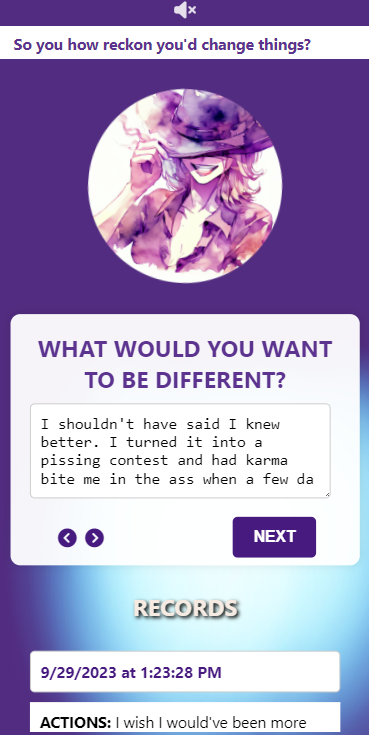

# Rememberin' Regrets

This is my demo to practice CRUD, with some small flair compared to your usual journaling app.

## Features
- Soothing background music that can be toggled on
- Voicelines for encouragement
- Focused meditative writing by identitying your specific regret, giving space for you to formulate your "ideal" situation, then reflect on what kind of impact that could have
- User is able to toggle back and forth from the "What would you want to be different" prompt in case they get more thoughts to add as they respond to the "If you changed things..."
- Older entries are saved to local storage and can be deleted

## Things to Do
- Stylize the entry details (e.g. placement of the minimize and delete button)
- Keep container div consistent; it changes depending on the prompt
- Implement user flow in case they don't have any regrets at the moment, should be acknowledged with a voiceline and victory counter